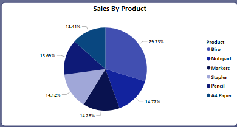
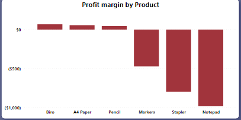
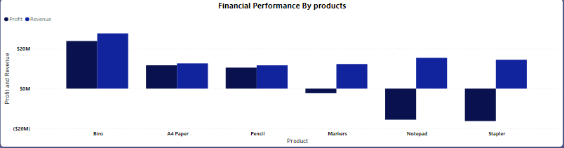

# 2014-Sales-Overview-And-Financial-performance
This essence of this project is to show-case my Data Cleaning and Visualization skills using Power BI.

## Introduction 
I came across this Dataset online and i admired how rich the Data is. I have been getting my hands dirty with some very rich Datasets to practice my analyses, Data cleaning and visualization skills.This project is meant to analyse, derive reasonable and meaningful insights on how crucial analytical questions can be answered and further help the store to make data driven decisions.

**_Disclaimer_**
- All Dataset and report do not represent any company or institution but just a dummy Dataset to demonstrate my capacity and figure out my competence in the use of Power BI for answering important questions, analyse and to prepare reports for data driven decision making.

## Problem Statement;
- What is the Total Sales in 2014 (Jan-Dec)?
- What Proportion of Sales does each of the products has?
- What is the Financial Performance of each of the products?
- Is there growth or decline in any of the products?
- What are the key products that are drivers performance?
- Which products should be discontinued due to poor outcome?  

## Data Modeling;
- No Data Modelling was required since i needed just a table for the analysis.

## Data Transforming/Cleaning;
### Analytical transformation of the table using Conditioning Column;
- To get the Discounted Rate for each of the four categories;

_Discount Rate_=IF([Discount Band]="None",0,IF([Discount Rate]="Low".0.01,IF([Discount Band]="Midium",0.05,0.1))).
### Analytical transformation of the table using Custom Column include the following:
- To have the idea of Total Gross Sales

_Gross sales_ =[Units sold]*[Sale price].

- To know the amount of Discount given to each of the four products,

 _Discount_ =[Discount Rate]*[Gross Sales].

- To know the Total Revenue generated,
  
_Revenue_ = [Gross Sales]-[Discount].

- To have the idea of the actual amount spent in the cause of manufacturing the products,

_Manufacture Cost_ =[Unit Sold]*[Manufacturing Price].

- To know the amount of the Profit gain before Tax (PBT),

_Profit Before Tax_ =[Revenue]-[Manufacture Cost].

- To know the Total Profit gain (PAT),

_Profit_ =[Profit Before Tax]-[Tax].

- To know the Total Profit Margin,

_Profit Margin_ =[Profit]/[Revenue].

## Power BI Concept Applied;
- Power Query: Custom Column.
- Conditioning column (IF).
- Button.
- Filter.
- Page Navigator.

## Analysis And Visualization:

### The report comprises of four pages

## 1. Report overview; 

### From the dashboard it can be observed that in 2014;
 - There are five segments[The store customers] (Channel partners,Enterprise,Government,Midmarket and Small business).
 - In five states[Location] (Lagos, Ogun,Ondo,Osun and Oyo).
 - there are also six products (Biro,A4 Paper,Pencil,Marker, Stapler and Notepad).
 - The highest sales of the year was recorded in the month of october, 2014 with Gross sales of $105,000.

 ## 2. Sales Proportion;
 
   

   - In 2014 Biro has the highest sales proportion representing 29.73%.

## 3. Profit Margin;

   

   - Biro also remitted the highest profit margin in the year 2014.

 ## 4. Financial Performance By Products;

  

  - It can also be deduced in the chart that in term of profit generation, Biro product contributed excellently to the financial growth of the store. In the same vein, Stapler product appeared to be the least in terms of profit generation.

  - **You can interact with the dashboard Here** ()

## Conclusion: 
1.On the dashboard, it was observed that in 2014; 
- Total revenue generated = $94.28M.
- Total profit gain = $11.98M.
- Total Gross sales = $99.37M.
2. The month of october has the highest sales in 2014($105,000).
3. In terms of financial performances among the products,Biro performed excellently.
4. Biro also has the highest sales proportion among other products.
4. Biro also generated the highest profit margin among other products.

## Recommendation:
1. Biro, A4 paper and pencil are the key product drivers of performance.
2. Notepad,Stapler should be discontinued due to poor financial performance outcome.
3. To answer whether there's growth or decline in any of the products, the Dataset of the previous years will be required for comparison and for further Data decision making that could be beneficial for the store in the future.

### Thank you

