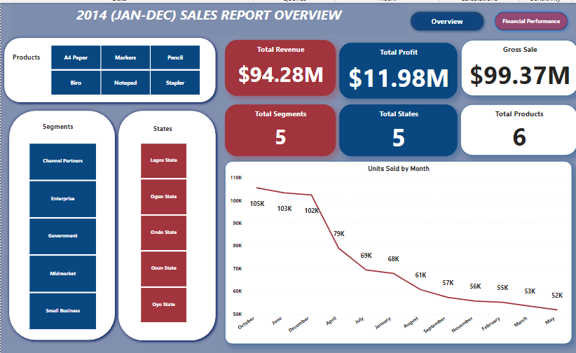

# 2014-Sales-Overview-And-Financial-performance
This project is to show-case my Data Cleaning and Visualization skills using Power BI.

## Introduction 
I came across the Dataset online and admired how rich the Data is, as i have been getting my hands dirty with avery rich Dataset to practice my analysis skills of Data cleaning,analysis and visualization.This project is to analyse and derive insight to answer crucial questions and help the store to make data driven decisions.

**_Disclaimer_**
- All Dataset and report do not represents any company,institution but just a dummy Dataset to demonstrate my capacity of using Power BI for answering crucial questions,analyse and to prepare reports for data driven decision making.

## Problem Statement;
- What is the Total Sales in 2014 (Jan-Dec)?
- What Proportion of Sales does each products has?
- What is the Financial Performance of each products?
- Is there growth or decline in any of the products?
- What are the key products that are drivers performance?
- Which products should be discontinue sub due to poor outcome?  

## Data Modeling;
- No Data Modelling was required since i needed just a table for the analysis.

## Data Transforming/Cleaning;
### Analytical transformation of the table using Conditioning Column;
- To get the Discount Rate for each categories of discount,

_Discount Rate_=IF([Discount Band]="None",0,IF([Discount Rate]="Low".0.01,IF([Discount Band]="Midium",0.05,0.1))).
### Analytical transformation of the table using Custom Column include the following:
- To have the idea of Total Gross Sales

_Gross sales_ =[Units sold]*[Sale price].

- To know the amount of Discount given to each product,

 _Discount_ =[Discount Rate]*[Gross Sales].

- To know the Total Revenue generated,
  
_Revenue_ = [Gross Sales]-[Discount].

- To have the idea of the amount spent in the cause of manufacturing the products,

_Manufacture Cost_ =[Unit Sold]*[Manufacturing Price].

- To know the amount of the Profit gain before Tax,

_Profit Before Tax_ =[Revenue]-[Manufacture Cost].

- To know the Total Profit gain,

_Profit_ =[Profit Before Tax]-[Tax].

- To know the Total Profit Margin,

_Profit Margin_ =[Profit]/[Revenue].

## Power BI Concept Applied;
- Power Query: Custom Column.
- Conditioning column (IF).
- Button.
- Filter.
- Page Navigator.

## Analysis And Visualization:

### The report compose of 4 pages

## 1. Report overview; 

### From the dashboard its observed that in 2014;
 - There are five segments (Channel partners,Enterprise,Government,Midmarket and Small business).
 - In five states (Lagos, Ogun,Ondo,Osun and Oyo).
 - there are also six product (Biro,A4 Paper,Pencil,Marker and Notepad).
 - The highets sales is seen in the month of october in 2014 with Gross sales of 105 thousand.

 ## 2. Sales Proportion;
 
   

   - In 2014 Biro has the highest sales proportion which is (29.73%).

## 3. Profit Margin;

   

   - Biro also remitted the highest profit margin in 2014.

 ## 4. Financial Performance By Products;

  

  - It's observed in the chart that Biro performed excellently financially in term of profit, revenue and profit margin generated foolowed by A4 Paper and Pencil.

  - **You can interact with the dashboard Here** ()

## Conclusion: 
1.On the dashboard, it's observed in 2014 that; 
- Total revenue generated = $94.28M.
- Total profit gain = $11.98M.
- Total Gross sales = $99.37M.
2. The month of october has the highest sales in 2014 amount to be (Units sold=105).
3. Interm of financial performance among the product,Biro performed excellently.
4. Biro also has the highest sales proportions among the products.
4. Biro also generated the highest profit margin among the products.

## Recommendation:
1. Biro,A4 paper and pencil are the key products drivers of performance.
2. Notepad,Stapler should be discontinue due to poor financial performance outcome.
3. To answer whether there's growth or decline in any of the products,the Dataset of the previous years will be required for comparison and Data driven decision making.

